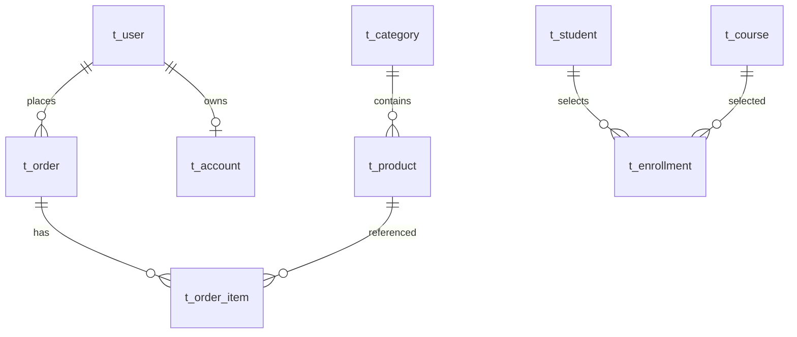

# javalean 表结构概览

> 库名：`javalean`，引擎：InnoDB，字符集：utf8mb4

## 表清单（当前数据量参考）

| 表名 | 注释 | 约行数 |
|------|------|--------|
| `t_user` | 用户 | 4 |
| `t_category` | 分类 | 4 |
| `t_product` | 商品 | 5 |
| `t_order` | 订单 | 2 |
| `t_order_item` | 订单明细 | 4 |
| `t_account` | 账户余额 | 3 |
| `t_student` | 学生 | 3 |
| `t_course` | 课程 | 3 |
| `t_enrollment` | 选课（复合主键） | 5 |

## 关系示意

## 字段摘要

### t_user

| 列 | 类型 | 说明 |
|----|------|------|
| id | BIGINT PK | 自增 |
| username | VARCHAR(50) | 唯一 |
| email | VARCHAR(100) | |
| age | INT | |
| status | TINYINT | 1 启用，0 禁用 |
| created_at | DATETIME | 默认当前时间 |

### t_category

| 列 | 类型 | 说明 |
|----|------|------|
| id | INT PK | |
| name | VARCHAR(50) | |
| parent_id | INT | 父分类，可 NULL |
| sort_order | INT | 排序 |

### t_product

| 列 | 类型 | 说明 |
|----|------|------|
| id | BIGINT PK | |
| category_id | INT FK → t_category | |
| name | VARCHAR(100) | |
| price | DECIMAL(10,2) | |
| stock | INT | 库存 |

### t_order / t_order_item

- 订单：`user_id`、`order_no`（唯一）、`total_amount`、`status`（CREATED/PAID/CANCELLED）
- 明细：`order_id`、`product_id`、`quantity`、`unit_price`

### t_account

| 列 | 类型 | 说明 |
|----|------|------|
| user_id | BIGINT UNIQUE FK | 一对一用户 |
| balance | DECIMAL(12,2) | 余额 |

### t_student / t_course / t_enrollment

- 选课表主键：`(student_id, course_id)`，`score` 可为 NULL（未出分）

## 后续 Java 模块对应

| 练习场景 | 建议 moduleId |
|----------|----------------|
| JDBC CRUD | `jb-10-jdbc` |
| JPA 实体 | `sb-05-jpa` |
| MyBatis | `sb-06-mybatis` |
| 事务转账 | `jb-10-jdbc` 或 Spring 扩展 |
