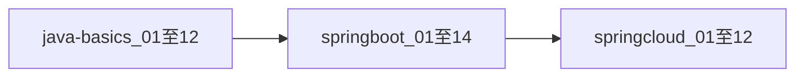

# 学习路线

本文档描述 JavaLean 三板块的推荐学习顺序与周计划参考。

## 推荐路径

1. **Java 编程基础**（12 篇）— 不依赖 Spring，打牢语法与 API。
2. **Spring Boot**（14 篇）— Web、数据访问、AOP、异常、安全等。
3. **Spring Cloud**（12 篇）— 微服务注册、配置、Feign、Gateway、熔断、链路、消息等。

每学完一篇文档，建议在阶段二创建对应 `moduleId` 子项目并自测通过后再进入下一篇。

## 周计划参考（约 10～12 周）

| 周次 | 内容 | 文档范围 |
|------|------|----------|
| 1～2 | Java 基础 | [java-basics/01](java-basics/01-变量与数据类型.md)～[06](java-basics/06-泛型.md) |
| 3～4 | Java 基础续 | [07](java-basics/07-IO与NIO入门.md)～[12](java-basics/12-Java8-17新特性速览.md) |
| 5～6 | Spring Boot 入门 | [springboot/01](springboot/01-项目结构与自动配置.md)～[07](springboot/07-AOP.md) |
| 7～8 | Spring Boot 进阶 | [08](springboot/08-全局异常处理.md)～[14](springboot/14-单元与集成测试.md) |
| 9～10 | Spring Cloud 核心 | [springcloud/01](springcloud/01-微服务架构概览.md)～[07](springcloud/07-熔断降级-Resilience4j.md) |
| 11～12 | Spring Cloud 扩展与综合 | [08](springcloud/08-分布式链路追踪.md)～[12](springcloud/12-综合演练-迷你电商.md) |

可按自身节奏调整；Cloud 部分需预留本地多进程联调时间，见 [springcloud/_labs/local-dev-ports.md](springcloud/_labs/local-dev-ports.md)。

## 并行策略

- **文档驱动**：以 `docs/` 中「子项目规格」为唯一实现依据。
- **最小单元**：一个知识点 = 一个（或一对）独立 Maven 工程。
- **验证门槛**：`mvn test` 通过，或文档规定的 HTTP/curl 检查通过。

## 前置依赖关系（节选）

| 文档 | 建议前置 |
|------|----------|
| springboot/05 JPA | springboot/01、04 |
| springboot/07 AOP | springboot/04 |
| springcloud/04 Feign | springcloud/02 Eureka |
| springcloud/05 Gateway | springcloud/02、04 |
| springcloud/12 综合演练 | springcloud/02～08 |

## 下一步

打开 [docs/README.md](README.md) 查看完整文档索引与 `moduleId` 对照表。
