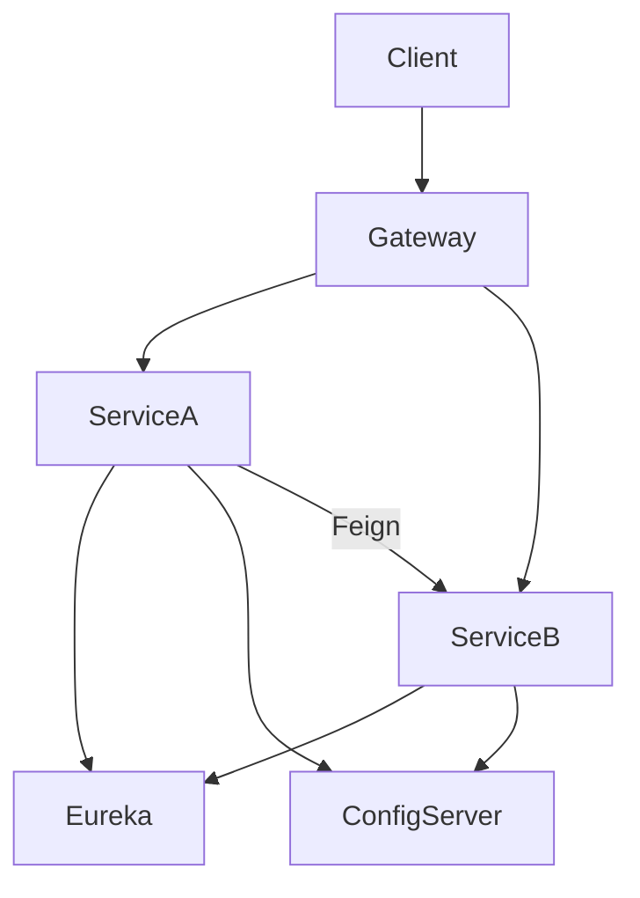

# 微服务架构概览

## 元信息

| 项 | 值 |
|----|-----|
| 板块 | springcloud |
| 难度 | 入门 |
| 预估时长 | 2 小时 |
| 前置 | Spring Boot 基础 |
| **moduleId** | 无（纯概念） |

## 学习目标

- [ ] 理解单体、SOA、微服务的演进与取舍
- [ ] 说出微服务常见组件：注册发现、配置、网关、熔断、追踪
- [ ] 了解 CAP、最终一致性与分布式事务挑战
- [ ] 能对照 JavaLean 后续 `sc-*` 模块画出架构草图

## 核心概念

### 定义

微服务将系统按业务能力拆分为可独立部署的小服务，通过轻量通信协作。Spring Cloud 提供 Netflix/Alibaba 等组件的 Spring 集成。

### 常见误区

- 为微服务而微服务（小规模项目单体更合适）
- 忽视运维成本（部署、监控、链路）
- 认为拆分后自然获得高性能

## 架构草图

## 与 JavaLean 模块映射

| 能力 | 文档 | moduleId |
|------|------|----------|
| 注册发现 | 02 | sc-eureka-* |
| 配置中心 | 03 | sc-config-* |
| 远程调用 | 04 | sc-feign-* |
| 网关 | 05 | sc-gateway |
| 负载均衡 | 06 | sc-loadbalancer-demo |
| 熔断 | 07 | sc-resilience4j |
| 链路追踪 | 08 | sc-sleuth-zipkin |
| 消息 | 09 | sc-rabbitmq-demo |

## 练习

1. 画你熟悉的一个业务（如外卖）的微服务拆分图。
2. 列出单体改微服务的前三个风险。

## 参考资料

- [Spring Cloud](https://spring.io/projects/spring-cloud)
- [Microservices - Martin Fowler](https://martinfowler.com/articles/microservices.html)
